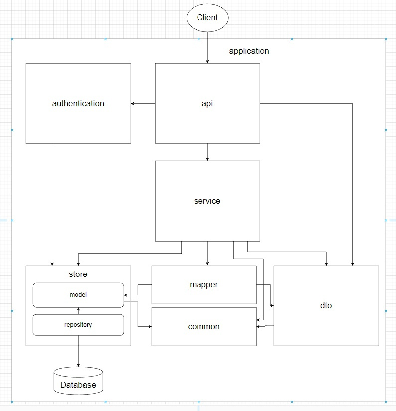

# Digital Design Итоговое задание

## Целевая архитектура

## Описание модулей
* Модуль [api](./api) представляет собой интерфейс взаимодействия с приложением извне. Формат взаимодействия пока
  не определен, но скорее всего будет являться REST API. Контроллеры принимают запрос извне и вызывают соответсвующий
  обработчик из модуля service, передавая в сервис параметры из запроса в виде сущностей из модуля dto. После обработки
  запроса контроллер подгатавливает и отправляет ответ клиенту(заголовки, тело ответа, возвращаемый статус и другие).
* Модуль [authentication](./application) реализует механизм аутентификации пользователя в системе. Аутентификация
  необходима для защиты API от несанкционированного доступа извне
* Модуль [dto](./dto) предоставляет сущности, которомы можно описать параметры запроса и тела ответов модуля
  [api](./api) в виде единого объекта. Объекты классов этого модуля также являются средством передачи данных из модуля
  [api](./api) в модуль [service](./service)
* Модуль [service](./service) реализует бизнес-логику приложения. Классы модуля реализуют набор допустимых операций в
  соответствии с бизнес требованиями. Вызовы методов сервисного слоя происходят из модуля [api](./api) и принимают
  информацию о запросе в виде [dto](./dto). В соответствии с выполняемой задачей [dto](./dto) может преобразоваться в
  соответсвующий объект модуля [model](./store/model) (при помощи модуля [mapper](./mapper))  для изменения или извлечения
  данных из модуля [repository](./store/repository). По завершению выполнения операции из модуля [service](./service)
  возвращается объект модуля [dto](./dto), описывающий результат выполнения операции.
* Модуль [model](./store/model) представляет классы, описывающие сущности хранящиеся в хранилище данных. Для описания
  таблиц, значения которых заранее определены и фиксированы используется модуль [status](./status)
* Модуль [repository](./store/repository) представляет собой интерфейс взаимодействия с хранилищем данных и описывает
  допустимые операции, которые можно производить над хранилищем данных(например выборка или добавление данных). Для
  описания сущностей, хранящихся в хранилище данных используются классы из модуля [model](./store/model)
  и [status](./status)
* Модуль [status](./status) предназначен для описания таблиц, значения которых заранее определены и фиксированы
* Модуль [mapper](./mapper) предоставляет функциональность конвертации сущностей из модуля [model](./store/model) в
  сущности [dto](./dto) и обратно
