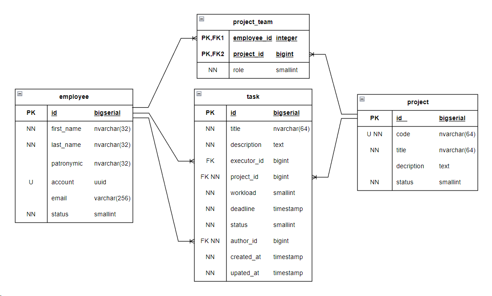
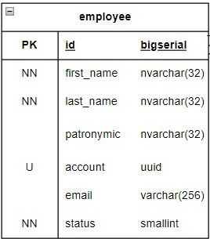
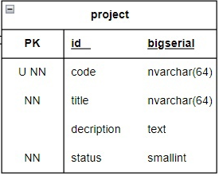
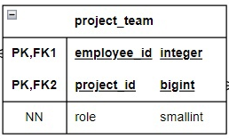
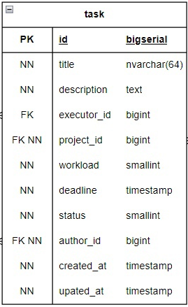

# Описание базы данных

## Физическая модель базы данных

## Таблица employee

Таблица описывает профиль сотрудника компании

Аттрибуры:
- **id** - _уникальный идентификатор_, в виде большого автоинкрементируемого целого числа. Является суррогатным 
  первичным ключом, позволяющим однозначно идентифицировать каждого сотрудника
- **first_name** - _имя_ сотрудника в виде строки переменной длины. Максимальная длина - _32 символа_. _Обязательно к 
  заполнению_
- **last_name** - _фамилия_ сотрудника в виде строки переменной длины. Максимальная длина - _32 символа_. _Обязательно к 
  заполнению_
- **patronymic** - _отчество_ сотрудника в виде строки переменной длины. Максимальная длина - _32 символа_. _Обязательно
  к заполнению_
- **account** - _учетная запись_ пользователя в виде строки, состоящей из 36 символов (см. 
  [RCFC 4122](https://datatracker.ietf.org/doc/html/rfc4122)). Значение _необязательно к заполнению_ и является 
  уникальным
- **email** - _адрес электронной почты_ сотрудника в виде строки переменной длины. Максимальная длина - _256 символов_.
  _Значение _необязательно к заполнению_
- **status** - _статус_ сотрудника в виде _маленького целого числа_, которое представляет собой порядковы номер 
  значения, определенного в перечислении 
  [EmployeeStatus](./../common/src/main/java/org/example/status/EmployeeStatus.java). Таким образом, значение _0_ 
  значит, что сотрудник _активен_, а значение _1_ - _неактивен_. _Обязательно к заполнению_

## Таблица project

Таблица описывает проект компании

Аттрибуры:
- **id** - _уникальный идентификатор_, в виде большого автоинкрементируемого целого числа. Является суррогатным 
  первичным ключом, позволяющим однозначно идентифицировать каждый проект
- **code** - _код_ проекта в виде строки переменной длины. Максимальная длина - _64 символа_. _Обязательно к заполнению_
  и является _уникальным значением_ для каждого проекта
- **title** - _наименование_ проекта в виде строки переменной длины. Максимальная длина - _64 символа_. _Обязательно к
  заполнению_
- **description** - _описание_ проекта в виде строки переменной длины. Длина описания _неограничена_. _Необязательно к
  заполнению_
- **status** - _статус_ проекта в виде _маленького целого числа_, которое представляет собой порядковы номер значения,
  определенного в перечислении [ProjectStatus](./../common/src/main/java/org/example/status/ProjectStatus.java). Таким
  образом, значение _0_ значит, что проект находится в состоянии _черновик_, значение _1_ значит, что проект находится в
  состоянии _разработки_, значение _2_ значит, что проект находится в состоянии _тестирования_, а значение _3_ значит,
  что проект _завершен_. _Обязательно к заполению_.

## Таблица project_team

Таблица описывает команды проектов. То есть в каких проектах какие сотрудники принимают участие

Аттрибуты:
- **employee_id** - _внешний ключ_, ссылающийся на запись таблицы _employee_, в виде _большого целого числа_. Аттрибут
  описывает сотрудника, принимающего участие в команде проекта. 
- **project_id** - _внешний ключ_, ссылающийся на запись таблицы _project_, в виде _большого целого числа_. Аттрибут 
  описывает проект, к которому относится команда.
- **employee_id** и **project_id** вместе являются составным первичным ключом, позволяющим однозначно идентифицировать 
  сотрудников внутри проекта.
- **role** - _роль_ сотрудника в проекте в виде _маленького целого числа_, которое представляет собой порядковы номер 
  значения, определенного в перечислении 
  [ProjectTeamRole](./../common/src/main/java/org/example/status/ProjectTeamRole.java). Таким образом, значение _0_ 
  значит, что сотрудник является _руководителем проекта_, значение _1_ значит, что сотрудник является _аналитиком_,
  значение _2_ значит, что сотрудник является _разработчиком_, а значение _3_ значит, что сотрудник является 
  _тестрировщиком_. _Обязательно к заполению_.

## Таблица task

Таблица описывает все задачи в компании

Аттрибуты:
- **id** - _уникальный идентификатор_, в виде большого автоинкрементируемого целого числа. Является суррогатным 
  первичным ключом, позволяющим однозначно идентифицировать каждую задачу
- **title** - _наименование_ задачи в виде строки переменной длины. Максимальная длина - _64 символа_. _Обязательно к
  заполнению_
- **description** - _описание_ задачи в виде строки переменной длины. Длина описания _неограничена_. _Необязательно к
  заполнению_
- **executor_id** - _внешний ключ_, ссылающийся на запись таблицы _employee_, в виде _большого целого числа_. Аттрибут
  описывает участника проекта, ответсвенного за выполнение задачи. _Необязательно к заполнению_
- **project_id** - _внешний ключ_, ссылающийся на запись таблицы _project_, в виде _большого целого числа_. Аттрибут
  описывает проект, к которому относится задача. _Обязательно к заполнению_
- **workload** - приблизительные _трудозатраты в часах_ необходимые на выполнение задачи, в виде _маленького целого 
  числа_. _Обязательно к заполнению_.
- **deadline** - _крайний срок_ для исполнения задачи, в виде _даты и времени без часового пояса_. _Обязательно к 
  заполнению_.
- **status** - _статус_ задачи в виде _маленького целого числа_, которое представляет собой порядковы номер значения,
  определенного в перечислении [TaskStatus](./../common/src/main/java/org/example/status/TaskStatus.java). Таким
  образом, значение _0_ значит, что задача находится в состоянии _новая_, значение _1_ значит, что задача находится в 
  состоянии _в работе_, значение _2_ значит, что задача находится в состоянии _выполнена_, а значение _3_ значит, что 
  задача _закрыта_. _Обязательно к заполнению_.
- **author_id** - _внешний ключ_, ссылающийся на запись таблицы _employee_, в виде _большого целого числа_. Аттрибут
  описывает участника проекта, создавшего задачу. _Обязательно к заполнению_.
- **created_at** - _дата создания_ задачи, в виде _даты и времени без часового пояса_. _Обязательно к заполнению_.
- **updated_at** - _дата обновления_ задачи (_но не изменения статуса_), в виде _даты и времени без часового пояса_.
  _Обязательно к заполнению_.
